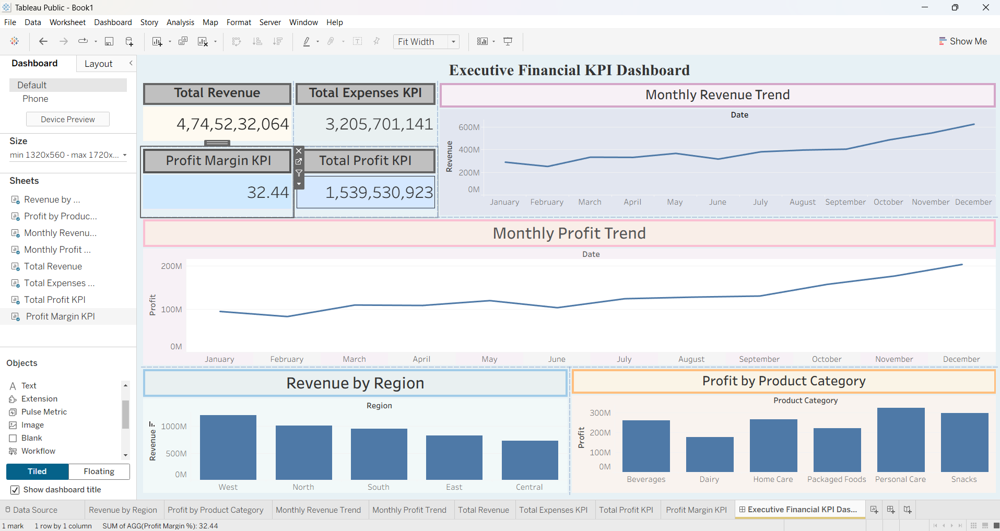

# Financial KPI Dashboard

## Overview

An interactive Financial KPI Dashboard built using Python, MySQL, SQL, and Tableau to monitor business performance, track key financial metrics, and support executive decision-making.

The project simulates a real FMCG company by generating 25,000+ financial transactions and analyzing revenue, expenses, profit, profit margins, regional performance, and product category trends.

---

## Business Problem

Financial managers require a centralized dashboard to monitor organizational performance and identify revenue drivers, profit opportunities, and operational inefficiencies.

This project provides:

* Revenue monitoring
* Profitability analysis
* Regional performance tracking
* Product category analysis
* Executive KPI reporting
* Business trend visualization

---

## Technologies Used

* Python
* Pandas
* NumPy
* MySQL
* SQL
* Tableau
* Git
* GitHub

---

## Dataset

A synthetic FMCG financial dataset containing:

* 25,000+ transactions
* 5 Regions
* 5 Departments
* 6 Product Categories
* 2 Years of financial data

### Key Fields

* Transaction_ID
* Date
* Region
* Department
* Product_Category
* Revenue
* Expenses
* Profit
* Budget_Target
* Quarter
* Year

---

## Project Structure

```text
Financial-KPI-Dashboard/

├── dashboard/
│   └── Executive_Financial_KPI_Dashboard.twb

├── data/
│   └── financial_data.csv

├── screenshots/
│   └── dashboard_final.png

├── sql/
│   ├── Business_analysis.sql
│   ├── data_quality_checks.sql
│   ├── data_validation.sql
│   └── kpi_queries.sql

├── generate_data.py
├── requirements.txt
├── README.md
└── .gitignore
```

---

## Dashboard Preview



---

## Key Performance Indicators

* Total Revenue
* Total Expenses
* Total Profit
* Profit Margin (%)

---

## Business Insights

### Revenue Trend Analysis

* Identified seasonal revenue fluctuations across the financial year.
* Observed strong revenue growth during peak sales periods.

### Regional Performance Analysis

* Compared financial performance across North, South, East, West, and Central regions.
* Identified top-performing regions contributing to overall revenue.

### Product Category Analysis

* Evaluated profitability across multiple product categories.
* Highlighted categories with the highest profit contribution.

---

## SQL Analysis

The project includes:

* Data Validation Queries
* Data Quality Checks
* KPI Calculations
* Business Analysis Queries

Key metrics calculated:

* Total Revenue
* Total Expenses
* Total Profit
* Profit Margin
* Revenue by Region
* Profit by Product Category
* Monthly Revenue Trends
* Monthly Profit Trends

---

## Results

* Processed 25,000+ financial transactions.
* Built 8+ interactive KPI visualizations.
* Performed financial performance analysis across multiple business dimensions.
* Developed an executive dashboard for business intelligence and reporting.

---

## Future Improvements

* Real-time database integration
* Automated dashboard refresh
* Predictive revenue forecasting
* Budget variance analysis
* Financial anomaly detection

---

## Author

Harshitha G.R.

IIT Madras | Mechanical Engineering

Interested in Data Analytics, Machine Learning, and Business Intelligence.
